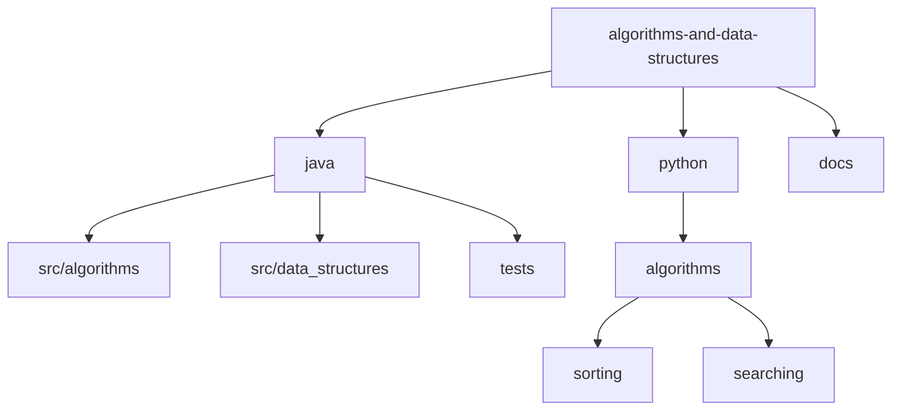

# Data Structures and Algorithms 🎯

[](https://www.oracle.com/java/)
[](https://www.python.org/)
[](LICENSE)
[](CONTRIBUTING.md)

> A comprehensive collection of data structures and algorithms implemented in multiple programming languages. Perfect for learning, interviews, and competitive programming!

[✨ Features](#features) • [💻 Languages](#languages) • [📁 Structure](#project-structure) • [🚀 Quick Start](#getting-started) • [🤝 Contributing](#contributing)

## 📑 Table of Contents

- [✨ Features](#features)
- [💻 Languages](#languages)
- [📁 Project Structure](#project-structure)
- [🚀 Getting Started](#getting-started)
  - [Prerequisites](#prerequisites)
  - [Setup](#setup)
- [📚 Documentation](#documentation)
  - [Data Structures](#data-structures)
  - [Algorithms](#algorithms)
- [🤝 Contributing](#contributing)
- [✍️ Authors](#authors)
- [📚 How to Cite](#how-to-cite)
- [📄 License](#license)
- [🙏 Acknowledgments](#acknowledgments)

## ✨ Features

- Clean, efficient implementations of common data structures
- Well-documented algorithms with time and space complexity analysis
- Comprehensive test coverage for all implementations
- Language-specific best practices and idioms
- Interview preparation materials and example problems
- Multiple implementation approaches with comparisons

## 💻 Languages

Currently implemented in:

- Java (JDK 17+)
- Python (3.8+)

_Future languages planned: JavaScript, C++_

## 📁 Project Structure



<details>
<summary>Click to expand full directory structure</summary>

```plaintext
algorithms-and-data-structures/
├── README.md
├── CONTRIBUTING.md
├── LICENSE
├── docs/
│   └── implementation_guides/
├── java/
│   ├── README.md
│   ├── src/
│   │   ├── algorithms/
│   │   │   ├── sorting/
│   │   │   ├── searching/
│   │   │   └── graph/
│   │   └── data_structures/
│   │       ├── linear/
│   │       ├── trees/
│   │       └── graphs/
│   └── tests/
└── python/
    ├── README.md
    ├── algorithms/
    │   ├── sorting/
    │   │   ├── bubble_sort/
    │   │   ├── bucket_sort/
    │   │   ├── counting_sort/
    │   │   ├── heap_sort/
    │   │   ├── insertion_sort/
    │   │   ├── merge_sort/
    │   │   ├── quick_sort/
    │   │   ├── radix_sort/
    │   │   ├── selection_sort/
    │   │   └── tim_sort/
    │   └── searching/
    │       ├── binary_search/
    │       ├── exponential_search/
    │       ├── fibonacci_search/
    │       ├── hash_based_search/
    │       ├── interpolation_search/
    │       ├── jump_search/
    │       ├── linear_search/
    │       └── ternary_search/
    ├── tests/
    │   └── algorithms/
    │       ├── searching/
    │       │   ├── test_binary_search.py
    │       │   ├── test_exponential_search.py
    │       │   ├── test_fibonacci_search.py
    │       │   ├── test_hash_based_search.py
    │       │   ├── test_interpolation_search.py
    │       │   ├── test_jump_search.py
    │       │   ├── test_linear_search.py
    │       │   └── test_ternary_search.py
    │       └── sorting/
    │           ├── test_bubble_sort.py
    │           ├── test_bucket_sort.py
    │           ├── test_counting_sort.py
    │           ├── test_heap_sort.py
    │           ├── test_insertion_sort.py
    │           ├── test_merge_sort.py
    │           ├── test_quick_sort.py
    │           ├── test_radix_sort.py
    │           ├── test_selection_sort.py
    │           └── test_tim_sort.py
    ├── benchmarks/
    │   ├── search_benchmark_results.md
    │   └── sort_benchmark_results.md
    ├── requirements.txt
    └── setup.py
```

</details>

## 🚀 Getting Started

### Prerequisites

- Java 17+ (for Java implementations)
- Python 3.8+ (for Python implementations)
- Git

### Setup

```bash
# Clone repository
git clone https://github.com/BjornMelin/algorithms-and-data-structures.git
cd algorithms-and-data-structures

# For Java
cd java
./gradlew build

# For Python
cd python
python -m pip install -r requirements.txt
python -m pytest
```

## 📚 Documentation

### Data Structures

| Structure   | Java | Python | Time Complexity (Average)  |
| ----------- | ---- | ------ | -------------------------- |
| Linked List | ✅   | ❌     | Access: O(n), Insert: O(1) |
| Binary Tree | ✅   | ❌     | Search: O(log n)           |
| Hash Table  | ✅   | ❌     | Search: O(1)               |
| Stack       | ✅   | ❌     | Push/Pop: O(1)             |
| Queue       | ✅   | ❌     | Enqueue/Dequeue: O(1)      |

### Algorithms

| Algorithm            | Category  | Java | Python | Time Complexity |
| -------------------- | --------- | ---- | ------ | --------------- |
| Quick Sort           | Sorting   | ✅   | ✅     | O(n log n)      |
| Merge Sort           | Sorting   | ✅   | ✅     | O(n log n)      |
| Heap Sort            | Sorting   | ✅   | ✅     | O(n log n)      |
| Binary Search        | Searching | ✅   | ✅     | O(log n)        |
| Linear Search        | Searching | ❌   | ✅     | O(n)            |
| Jump Search          | Searching | ❌   | ✅     | O(√n)           |
| Interpolation Search | Searching | ❌   | ✅     | O(log log n)    |
| Exponential Search   | Searching | ❌   | ✅     | O(log n)        |
| Fibonacci Search     | Searching | ❌   | ✅     | O(log n)        |
| Ternary Search       | Searching | ❌   | ✅     | O(log n)        |
| Hash-based Search    | Searching | ❌   | ✅     | O(1)            |
| Bubble Sort          | Sorting   | ❌   | ✅     | O(n^2)          |
| Selection Sort       | Sorting   | ❌   | ✅     | O(n^2)          |
| Insertion Sort       | Sorting   | ❌   | ✅     | O(n^2)          |
| Radix Sort           | Sorting   | ❌   | ✅     | O(nk)           |
| Counting Sort        | Sorting   | ❌   | ✅     | O(n + k)        |
| Bucket Sort          | Sorting   | ❌   | ✅     | O(n + k)        |
| Tim Sort             | Sorting   | ❌   | ✅     | O(n log n)      |

## 🤝 Contributing

Contributions are welcome! Please read our [Contributing Guidelines](CONTRIBUTING.md) for details on how to submit pull requests, report issues, and contribute to the project.

## ✍️ Authors

**Bjorn Melin**

- GitHub: [@BjornMelin](https://github.com/BjornMelin)
- LinkedIn: [Bjorn Melin](https://linkedin.com/in/bjorn-melin)

## 📚 How to Cite

If you use this repository in your research or project, please cite it as:

```bibtex
@misc{melin2024dsa,
  author = {Melin, Bjorn},
  title = {Data Structures and Algorithms Implementation},
  year = {2024},
  publisher = {GitHub},
  journal = {GitHub Repository},
  howpublished = {\url{https://github.com/BjornMelin/algorithms-and-data-structures}},
  commit = {master}
}
```

## 📄 License

This project is licensed under the MIT License - see the [LICENSE](LICENSE) file for details.

## 🙏 Acknowledgments

- Various computer science textbooks and online resources
- Open source community
- Interview preparation materials

---

Made with ⚡️ by Bjorn Melin
