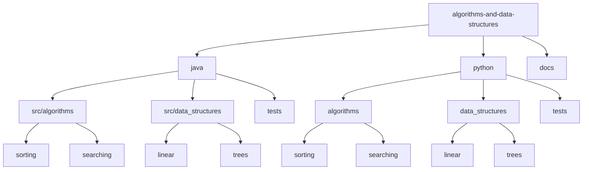

# Data Structures and Algorithms 🎯

[](https://www.oracle.com/java/)
[](https://www.python.org/)
[](LICENSE)
[](CONTRIBUTING.md)

> A comprehensive collection of data structures and algorithms implemented in multiple programming languages. Perfect for learning, interviews, and competitive programming!

[Features](#features) • [Languages](#languages) • [Structure](#structure) • [Quick Start](#quick-start) • [Contributing](#contributing)

## 📑 Table of Contents
- [Features](#features)
- [Languages](#languages)
- [Project Structure](#project-structure)
- [Getting Started](#getting-started)
  - [Prerequisites](#prerequisites)
  - [Setup](#setup)
- [Documentation](#documentation)
  - [Data Structures](#data-structures)
  - [Algorithms](#algorithms)
- [Contributing](#contributing)
- [Authors](#authors)
- [License](#license)
- [Acknowledgments](#acknowledgments)

## ✨ Features
- Clean, efficient implementations of common data structures
- Well-documented algorithms with time and space complexity analysis
- Comprehensive test coverage for all implementations
- Language-specific best practices and idioms
- Interview preparation materials and example problems
- Multiple implementation approaches with comparisons

## 💻 Languages
Currently implemented in:
- Java (JDK 17+)
- Python (3.8+)

*Future languages planned: JavaScript, C++*

## 📁 Project Structure



<details>
<summary>Click to expand full directory structure</summary>

```plaintext
algorithms-and-data-structures/
├── README.md
├── CONTRIBUTING.md
├── LICENSE
├── docs/
│   └── implementation_guides/
├── java/
│   ├── README.md
│   ├── src/
│   │   ├── algorithms/
│   │   │   ├── sorting/
│   │   │   ├── searching/
│   │   │   └── graph/
│   │   └── data_structures/
│   │       ├── linear/
│   │       ├── trees/
│   │       └── graphs/
│   └── tests/
└── python/
    ├── README.md
    ├── algorithms/
    │   ├── sorting/
    │   ├── searching/
    │   └── graph/
    ├── data_structures/
    │   ├── linear/
    │   ├── trees/
    │   └── graphs/
    └── tests/
```
</details>

## 🚀 Getting Started

### Prerequisites
- Java 17+ (for Java implementations)
- Python 3.8+ (for Python implementations)
- Git

### Setup

```bash
# Clone repository
git clone https://github.com/BjornMelin/algorithms-and-data-structures.git
cd algorithms-and-data-structures

# For Java
cd java
./gradlew build

# For Python
cd python
python -m pip install -r requirements.txt
python -m pytest
```

## 📚 Documentation

### Data Structures

| Structure | Java | Python | Time Complexity (Average) |
|-----------|------|--------|-------------------------|
| Linked List | ✅ | ✅ | Access: O(n), Insert: O(1) |
| Binary Tree | ✅ | ✅ | Search: O(log n) |
| Hash Table | ✅ | ✅ | Search: O(1) |
| Stack | ✅ | ✅ | Push/Pop: O(1) |
| Queue | ✅ | ✅ | Enqueue/Dequeue: O(1) |

### Algorithms

| Algorithm | Category | Java | Python | Time Complexity |
|-----------|----------|------|---------|----------------|
| Quick Sort | Sorting | ✅ | ✅ | O(n log n) |
| Merge Sort | Sorting | ✅ | ✅ | O(n log n) |
| Binary Search | Searching | ✅ | ✅ | O(log n) |
| DFS | Graph | ✅ | ✅ | O(V + E) |
| BFS | Graph | ✅ | ✅ | O(V + E) |

## 🤝 Contributing
Contributions are welcome! Please read our [Contributing Guidelines](CONTRIBUTING.md) for details on how to submit pull requests, report issues, and contribute to the project.

## ✍️ Authors
**Bjorn Melin**
- GitHub: [@BjornMelin](https://github.com/BjornMelin)
- LinkedIn: [Bjorn Melin](https://linkedin.com/in/bjorn-melin)

## 📄 License
This project is licensed under the MIT License - see the [LICENSE](LICENSE) file for details.

## 🙏 Acknowledgments
- Various computer science textbooks and online resources
- Open source community
- Interview preparation materials

---
Made with ⚡️ by Bjorn Melin
