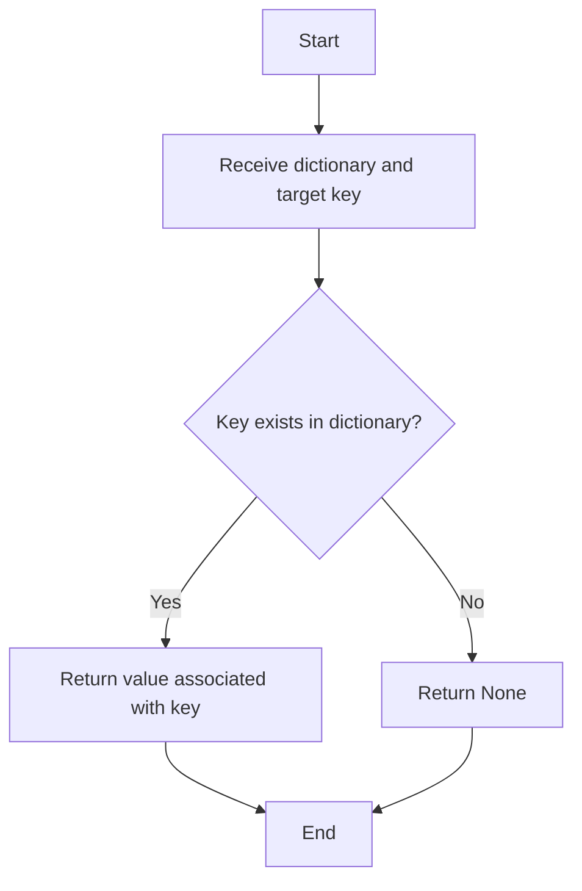

# Hash-Based Search Algorithm

## Table of Contents

- [Introduction](#introduction)
- [Algorithm Explanation](#algorithm-explanation)
- [Pseudocode](#pseudocode)
- [Time and Space Complexity](#time-and-space-complexity)
- [Mermaid Diagram](#mermaid-diagram)
- [Testing Results](#testing-results)
- [Usage Guide](#usage-guide)

## Introduction

Hash-Based Search is a searching algorithm that uses a hash table (dictionary in Python) to store elements for constant-time lookups. It is extremely efficient for searching but requires additional space to store the hash table.

## Algorithm Explanation

1. Create a hash table (dictionary) from the input data
2. For searching:
   - Use the target value as the key
   - If the key exists in the hash table, return its value
   - If the key doesn't exist, return None
3. The hash function internally maps keys to array indices for O(1) access

## Pseudocode

```
procedure hash_based_search(data: dictionary, target: key to find)
    if target exists in data then
        return data[target]
    else
        return None
```

## Time and Space Complexity

- **Best Case:** O(1) - Direct hash table lookup
- **Average Case:** O(1) - Hash table operations are constant time
- **Worst Case:** O(1) - Even in the worst case, lookup is constant time
- **Space Complexity:** O(n) - Need to store all elements in the hash table

## Mermaid Diagram



## Testing Results

| Test Case         | Input                    | Expected Output | Actual Output |
| ----------------- | ------------------------ | --------------- | ------------- |
| Element exists    | {1:'a', 2:'b'}, 1        | 'a'             | 'a'           |
| Element in middle | {1:'a', 2:'b', 3:'c'}, 2 | 'b'             | 'b'           |
| Element at end    | {1:'a', 2:'b', 3:'c'}, 3 | 'c'             | 'c'           |
| Element not found | {1:'a', 2:'b', 3:'c'}, 4 | None            | None          |
| Empty dictionary  | {}, 1                    | None            | None          |
| Single element    | {1:'a'}, 1               | 'a'             | 'a'           |

## Usage Guide

To use the hash-based search algorithm, follow these steps:

1. Import the hash-based search function from the module
2. Create a dictionary with your key-value pairs
3. Call the function with your dictionary and target key

```python
from hash_based_search import hash_based_search

data = {
    'apple': 5,
    'banana': 8,
    'orange': 3
}
target = 'banana'
result = hash_based_search(data, target)
print(f"Value for key '{target}': {result}")
```

### Additional Notes

- Hash-based search requires additional memory to store the hash table
- The hash table must be created before searching can begin
- This method is particularly efficient when multiple searches need to be performed on the same data
- Python dictionaries are implemented as hash tables internally
