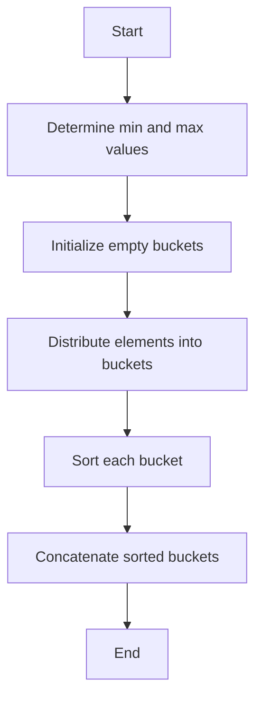

# Bucket Sort Algorithm

## Table of Contents

- [Introduction](#introduction)
- [Algorithm Explanation](#algorithm-explanation)
- [Pseudocode](#pseudocode)
- [Time and Space Complexity](#time-and-space-complexity)
- [Mermaid Diagram](#mermaid-diagram)
- [Testing Results](#testing-results)
- [Usage Guide](#usage-guide)

## Introduction

Bucket Sort is a distribution sort algorithm that works by distributing the elements
of an array into a number of buckets. Each bucket is then sorted individually, either
using a different sorting algorithm or by recursively applying the bucket sort algorithm.

## Algorithm Explanation

1. Determine the minimum and maximum values in the array.
2. Initialize a number of empty buckets.
3. Distribute the elements of the array into the buckets based on a calculated index.
4. Sort each bucket individually.
5. Concatenate the sorted buckets to form the final sorted array.

## Pseudocode

```
procedure bucketSort(A: list of sortable items)
    n := length(A)
    if n = 0 then
        return A
    end if
    min_value := min(A)
    max_value := max(A)
    bucket_count := n
    buckets := array of empty lists of size bucket_count
    for i := 0 to n-1 do
        index := (A[i] - min_value) / (max_value - min_value + 1) * bucket_count
        buckets[index].append(A[i])
    end for
    sorted_array := empty list
    for each bucket in buckets do
        sorted_array.extend(sort(bucket))
    end for
    return sorted_array
end procedure
```

## Time and Space Complexity

- **Best Case:** O(n + k) where k is the number of buckets
- **Average Case:** O(n + k)
- **Worst Case:** O(n^2) when all elements are placed in a single bucket
- **Space Complexity:** O(n + k)

## Mermaid Diagram



## Testing Results

| Test Case      | Input               | Expected Output   | Actual Output     |
| -------------- | ------------------- | ----------------- | ----------------- |
| Empty List     | []                  | []                | []                |
| Single Element | [1]                 | [1]               | [1]               |
| Already Sorted | [1, 2, 3, 4, 5]     | [1, 2, 3, 4, 5]   | [1, 2, 3, 4, 5]   |
| Reverse Sorted | [5, 4, 3, 2, 1]     | [1, 2, 3, 4, 5]   | [1, 2, 3, 4, 5]   |
| Duplicates     | [3, 1, 2, 3, 1]     | [1, 1, 2, 3, 3]   | [1, 1, 2, 3, 3]   |
| Large Dataset  | [1000, 999, ..., 1] | [1, 2, ..., 1000] | [1, 2, ..., 1000] |

## Usage Guide

To use the Bucket Sort algorithm, follow these steps:

1. Import the `bucket_sort` function from the `bucket_sort` module.
2. Pass the list of integers to be sorted as an argument to the `bucket_sort` function.
3. The function will return the sorted list of integers.

```python
from bucket_sort import bucket_sort

arr = [64, 34, 25, 12, 22, 11, 90]
sorted_arr = bucket_sort(arr)
print("Sorted array is:", sorted_arr)
```
