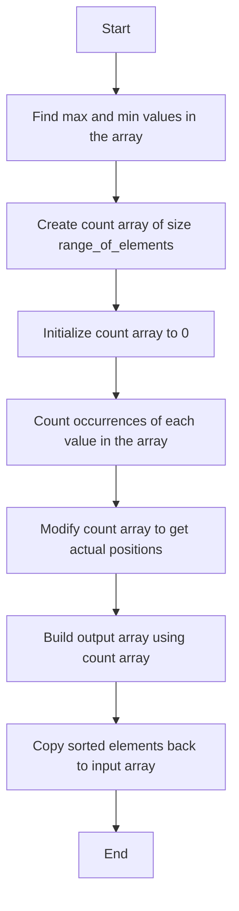

# Counting Sort Algorithm

## Table of Contents
- [Introduction](#introduction)
- [Algorithm Explanation](#algorithm-explanation)
- [Pseudocode](#pseudocode)
- [Time and Space Complexity](#time-and-space-complexity)
- [Mermaid Diagram](#mermaid-diagram)
- [Testing Results](#testing-results)
- [Usage Guide](#usage-guide)

## Introduction
Counting Sort is an integer sorting algorithm that operates by counting the 
number of objects that have distinct key values (kind of hashing). It is not 
a comparison-based sorting algorithm and its time complexity is O(n + k), 
where n is the number of elements in the input array and k is the range of 
the input.

## Algorithm Explanation
1. Find the maximum and minimum values in the input array.
2. Create a count array with a size equal to the range of the input values.
3. Count the occurrences of each value in the input array and store them in 
   the count array.
4. Modify the count array by adding the previous counts to get the actual 
   positions of the elements in the sorted array.
5. Build the output array by placing the elements in their correct positions 
   based on the count array.
6. Copy the sorted elements from the output array back to the input array.

## Pseudocode
```
procedure countingSort(A: list of integers)
    max_val := max(A)
    min_val := min(A)
    range_of_elements := max_val - min_val + 1

    count := array of size range_of_elements initialized to 0
    output := array of size length(A) initialized to 0

    for each num in A do
        count[num - min_val] := count[num - min_val] + 1

    for i := 1 to length(count) - 1 do
        count[i] := count[i] + count[i - 1]

    for each num in A in reverse order do
        output[count[num - min_val] - 1] := num
        count[num - min_val] := count[num - min_val] - 1

    for i := 0 to length(A) - 1 do
        A[i] := output[i]
end procedure
```

## Time and Space Complexity
- **Best Case:** O(n + k)
- **Average Case:** O(n + k)
- **Worst Case:** O(n + k)
- **Space Complexity:** O(n + k)

## Mermaid Diagram


## Testing Results
| Test Case                | Input                | Expected Output       | Actual Output         |
|--------------------------|----------------------|-----------------------|-----------------------|
| Empty List               | []                   | []                    | []                    |
| Single Element           | [1]                  | [1]                   | [1]                   |
| Already Sorted           | [1, 2, 3, 4, 5]      | [1, 2, 3, 4, 5]       | [1, 2, 3, 4, 5]       |
| Reverse Sorted           | [5, 4, 3, 2, 1]      | [1, 2, 3, 4, 5]       | [1, 2, 3, 4, 5]       |
| Duplicates               | [3, 1, 2, 3, 1]      | [1, 1, 2, 3, 3]       | [1, 1, 2, 3, 3]       |
| Large Dataset            | [1000, 999, ..., 1]  | [1, 2, ..., 1000]     | [1, 2, ..., 1000]     |

## Usage Guide
To use the Counting Sort algorithm, follow these steps:
1. Import the `counting_sort` function from the `counting_sort` module.
2. Pass the list of integers to be sorted as an argument to the `counting_sort` 
   function.
3. The function will return the sorted list of integers.

```python
from counting_sort import counting_sort

arr = [64, 34, 25, 12, 22, 11, 90]
sorted_arr = counting_sort(arr)
print("Sorted array is:", sorted_arr)
```
