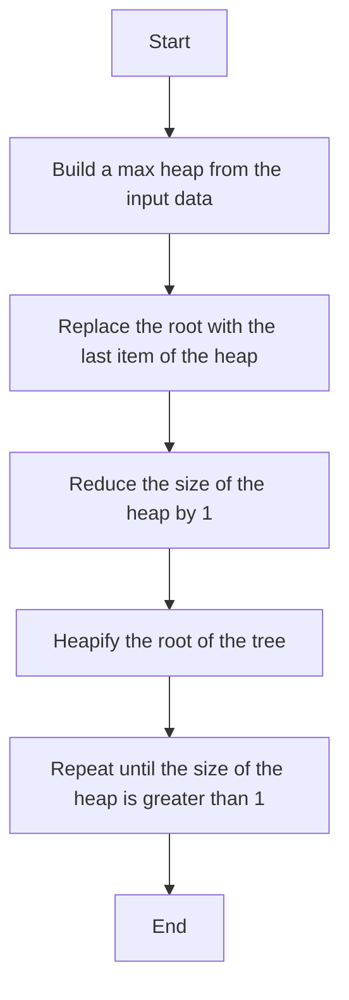

# Heap Sort Algorithm

## Table of Contents

- [Introduction](#introduction)
- [Algorithm Explanation](#algorithm-explanation)
- [Pseudocode](#pseudocode)
- [Time and Space Complexity](#time-and-space-complexity)
- [Mermaid Diagram](#mermaid-diagram)
- [Testing Results](#testing-results)
- [Usage Guide](#usage-guide)

## Introduction

Heap Sort is a comparison-based sorting algorithm that uses a binary heap data structure. It divides its input into a sorted and an unsorted region, and it iteratively shrinks the unsorted region by extracting the largest element and moving that to the sorted region.

## Algorithm Explanation

1. Build a max heap from the input data.
2. At this point, the largest item is stored at the root of the heap. Replace it with the last item of the heap followed by reducing the size of the heap by 1. Finally, heapify the root of the tree.
3. Repeat step 2 while the size of the heap is greater than 1.

## Pseudocode

```
procedure heapSort(A: list of sortable items)
    n := length(A)
    for i := n // 2 - 1 downto 0 do
        heapify(A, n, i)
    end for
    for i := n - 1 downto 0 do
        swap(A[0], A[i])
        heapify(A, i, 0)
    end for
end procedure

procedure heapify(A: list of sortable items, n: int, i: int)
    largest := i
    left := 2 * i + 1
    right := 2 * i + 2
    if left < n and A[left] > A[largest] then
        largest := left
    end if
    if right < n and A[right] > A[largest] then
        largest := right
    end if
    if largest != i then
        swap(A[i], A[largest])
        heapify(A, n, largest)
    end if
end procedure
```

## Time and Space Complexity

- **Best Case:** O(n log n)
- **Average Case:** O(n log n)
- **Worst Case:** O(n log n)
- **Space Complexity:** O(1)

## Mermaid Diagram



## Testing Results

| Test Case      | Input               | Expected Output   | Actual Output     |
| -------------- | ------------------- | ----------------- | ----------------- |
| Empty List     | []                  | []                | []                |
| Single Element | [1]                 | [1]               | [1]               |
| Already Sorted | [1, 2, 3, 4, 5]     | [1, 2, 3, 4, 5]   | [1, 2, 3, 4, 5]   |
| Reverse Sorted | [5, 4, 3, 2, 1]     | [1, 2, 3, 4, 5]   | [1, 2, 3, 4, 5]   |
| Duplicates     | [3, 1, 2, 3, 1]     | [1, 1, 2, 3, 3]   | [1, 1, 2, 3, 3]   |
| Large Dataset  | [1000, 999, ..., 1] | [1, 2, ..., 1000] | [1, 2, ..., 1000] |

## Usage Guide

To use the Heap Sort algorithm, follow these steps:

1. Import the `heap_sort` function from the `heap_sort` module.
2. Pass the list of integers to be sorted as an argument to the `heap_sort` function.
3. The function will return the sorted list of integers.

```python
from heap_sort import heap_sort

arr = [64, 34, 25, 12, 22, 11, 90]
sorted_arr = heap_sort(arr)
print("Sorted array is:", sorted_arr)
```
