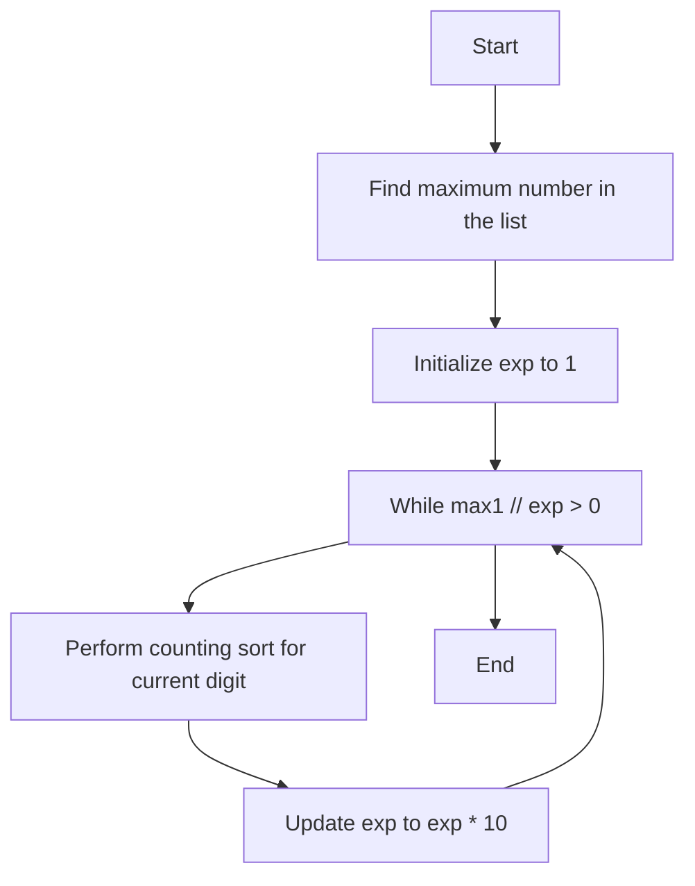

# Radix Sort Algorithm

## Table of Contents
- [Introduction](#introduction)
- [Algorithm Explanation](#algorithm-explanation)
- [Pseudocode](#pseudocode)
- [Time and Space Complexity](#time-and-space-complexity)
- [Mermaid Diagram](#mermaid-diagram)
- [Testing Results](#testing-results)
- [Usage Guide](#usage-guide)

## Introduction
Radix Sort is a non-comparative sorting algorithm that sorts integers by processing individual digits. It processes digits from the least significant to the most significant (LSD Radix Sort).

## Algorithm Explanation
1. Find the maximum number in the list to determine the number of digits.
2. Perform counting sort for each digit, starting from the least significant digit to the most significant digit.
3. Use the digit's value to place the number in the correct position in the output array.
4. Repeat the process for each digit until the entire list is sorted.

## Pseudocode
```
procedure radixSort(A: list of integers)
    max1 := maximum(A)
    exp := 1
    while max1 // exp > 0 do
        A := countingSortForRadix(A, exp)
        exp := exp * 10
    end while
end procedure

procedure countingSortForRadix(A: list of integers, exp: integer)
    n := length(A)
    output := array of n zeros
    count := array of 10 zeros

    for i := 0 to n-1 do
        index := (A[i] // exp) % 10
        count[index] := count[index] + 1
    end for

    for i := 1 to 9 do
        count[i] := count[i] + count[i - 1]
    end for

    for i := n-1 downto 0 do
        index := (A[i] // exp) % 10
        output[count[index] - 1] := A[i]
        count[index] := count[index] - 1
    end for

    for i := 0 to n-1 do
        A[i] := output[i]
    end for

    return A
end procedure
```

## Time and Space Complexity
- **Best Case:** O(nk)
- **Average Case:** O(nk)
- **Worst Case:** O(nk)
- **Space Complexity:** O(n + k)

## Mermaid Diagram


## Testing Results
| Test Case                | Input                | Expected Output       | Actual Output         |
|--------------------------|----------------------|-----------------------|-----------------------|
| Empty List               | []                   | []                    | []                    |
| Single Element           | [1]                  | [1]                   | [1]                   |
| Already Sorted           | [1, 2, 3, 4, 5]      | [1, 2, 3, 4, 5]       | [1, 2, 3, 4, 5]       |
| Reverse Sorted           | [5, 4, 3, 2, 1]      | [1, 2, 3, 4, 5]       | [1, 2, 3, 4, 5]       |
| Duplicates               | [3, 1, 2, 3, 1]      | [1, 1, 2, 3, 3]       | [1, 1, 2, 3, 3]       |
| Large Dataset            | [1000, 999, ..., 1]  | [1, 2, ..., 1000]     | [1, 2, ..., 1000]     |

## Usage Guide
To use the Radix Sort algorithm, follow these steps:
1. Import the `radix_sort` function from the `radix_sort` module.
2. Pass the list of integers to be sorted as an argument to the `radix_sort` function.
3. The function will return the sorted list of integers.

```python
from radix_sort import radix_sort

arr = [170, 45, 75, 90, 802, 24, 2, 66]
sorted_arr = radix_sort(arr)
print("Sorted array is:", sorted_arr)
```
